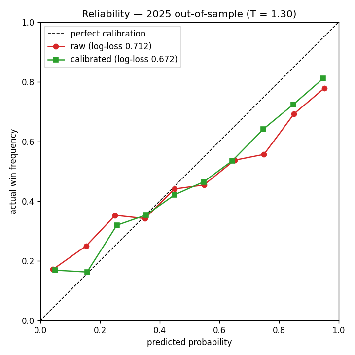
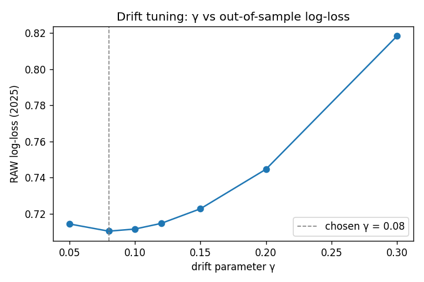
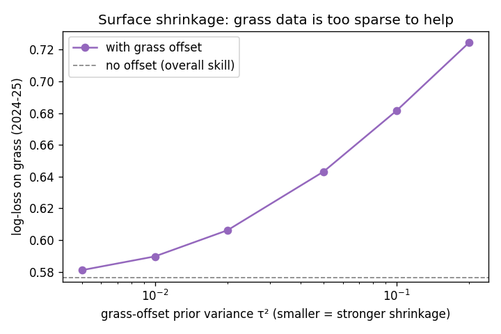

# Wimbledon 2026 Men's Singles — A Calibrated Forecasting Model

A from-scratch probabilistic forecasting model for ATP men's singles, built as a
quantitative research portfolio piece. The emphasis is **calibration** — not just
predicting the winner, but producing match-win probabilities that are *trustworthy*
and could be used to price a market.

The headline deliverable is a calibration study, not a betting record: a market
maker cares whether a stated 70% really happens 70% of the time.

## Approach

The model has two layers.

**1. Skill layer — a dynamic Bayesian serve/return filter.**
Each player holds a Gaussian belief over two latent skills: serve and return.
Every match contributes a binomial observation (serve points won / played), which
updates both the server's serve skill and the returner's return skill via an
approximate Kalman update (linearising the binomial-logit likelihood). Skills
drift over time as a random walk, so the model tracks form, ageing, and layoffs.

A per-player **grass offset** sits on top of overall skill, with a zero-mean prior
that shrinks toward overall skill when grass data is thin — the central modelling
idea, since grass is only ~10% of tour matches.

**2. Distribution layer — a hierarchical Markov match engine.**
Per-point serve probabilities feed an analytic game → set → match model
(Klaassen–Magnus), giving the full match-win probability and the distribution of
outcomes, not just a point estimate.

**Calibration.** Raw probabilities turn out to be over-confident (the Markov
structure amplifies small per-point edges). Temperature scaling, fit on a holdout
year, restores calibration.

## Results (strictly out-of-sample, no look-ahead)

The filter is only ever trained on matches *preceding* the evaluation period.

| Test year | accuracy | log-loss (raw) | log-loss (calibrated) | temperature |
|-----------|----------|----------------|-----------------------|-------------|
| 2024      | 0.63     | 0.71           | 0.67                  | 1.35        |
| 2025      | 0.62     | 0.71           | 0.67                  | 1.30        |

~62–63% accuracy is in line with the academic literature for pre-match ATP models.

**Calibration.** The raw model is over-confident; temperature scaling restores it:



**Hyperparameter tuning** (walk-forward, out-of-sample log-loss):





See [`notebooks/03_calibration_study.ipynb`](notebooks/03_calibration_study.ipynb)
for the full study.

## Key findings

1. **The serve/return filter recovers true skill.** On synthetic data with known
   skills it recovers serve and return ratings at correlation > 0.95.

2. **Raw probabilities are over-confident; calibration fixes it.** The reliability
   curve initially bows away from the diagonal (a predicted 0.9 wins ~0.78 of the
   time). Temperature scaling pulls it back without changing accuracy.

3. **More data beats post-hoc patching.** Using the full training history dropped
   the needed temperature from ~3.5 to ~1.3 — the raw probabilities became nearly
   well-calibrated on their own, showing the over-confidence was largely an
   estimation-noise problem, not a structural one.

4. **Surface-specific effects cannot be reliably estimated from sparse grass data.**
   A τ² grid search shows that *stronger* shrinkage of the grass offset always
   helps; the model is best off leaning almost entirely on overall skill. This is
   a deliberate, data-driven choice — and exactly the kind of "when not to trust a
   signal" judgment the shrinkage prior is designed to make.
   
## Model vs market

The real test for a pricing model is the market. On 1915 matched 2025 matches
(paired by player and year-month to disambiguate repeat meetings), the model is
compared against Pinnacle closing odds (de-vigged):

| | log-loss | Brier | accuracy |
|---|---|---|---|
| model     | 0.656 | 0.230 | 0.622 |
| Pinnacle  | 0.605 | 0.210 | 0.669 |

The model does **not** beat the market — as expected; a top sharp book is very
hard to beat. But an independent from-scratch model lands within ~0.05 log-loss
of Pinnacle, correlating at 0.73 — it captures most of the market's signal while
retaining independent information. Honestly quantifying the gap to a sharp
benchmark matters more than claiming to beat it.

See [`notebooks/model_vs_market.py`](notebooks/model_vs_market.py).

## Project structure
src/tennis_forecast/
data.py       load ATP match data, build serve/return observations, market odds
filter.py     the Bayesian serve/return Kalman filter (skill layer)
markov.py     analytic game/set/match win-probability engine
simulate.py   Monte-Carlo match & tournament simulation
pricing.py    de-vig, log-loss / Brier, reliability curve, temperature scaling
tests/
test_filter.py   synthetic-recovery, drift, and shrinkage tests
notebooks/
explore_filter.py          sanity-check skill rankings on real data
evaluate_predictions.py    walk-forward out-of-sample evaluation
tune_gamma.py / tune_tau.py / tune_joint.py   hyperparameter studies
03_calibration_study.ipynb headline calibration figures
## Methodology notes

- **Inference:** approximate Kalman filter (linearised binomial-logit likelihood),
  in the spirit of Szczecinski–Tihon (2023) and state-space tennis rating work.
- **Match model:** Klaassen–Magnus point-based Markov chain (points assumed i.i.d.
  within a match — a known simplification that under-weights "big-point" ability).
- **Hyperparameters:** drift γ = 0.10 and grass-shrinkage τ² = 0.005, both chosen
  by walk-forward cross-validation on out-of-sample log-loss.
- **No look-ahead:** temperature is fit on the last training year as a holdout;
  the test year is never seen during training.

## Reproducing

```bash
python -m venv .venv && source .venv/bin/activate
pip install -r requirements.txt
```

Data is not committed. Download:
- ATP match data: [Jeff Sackmann's tennis_atp](https://github.com/JeffSackmann/tennis_atp)
  → `data/raw/`
- Closing odds (optional, for the market study):
  [tennis-data.co.uk](http://www.tennis-data.co.uk/alldata.php) → `data/raw/odds/`

```bash
python tests/test_filter.py            # validate the filter
python notebooks/evaluate_predictions.py   # out-of-sample evaluation
```

## Data sources

- Match results & serve statistics: Jeff Sackmann `tennis_atp` (CC BY-NC-SA)
- Closing betting odds: tennis-data.co.uk

## License

Code under MIT (see `LICENSE`). Data is subject to its providers' licenses and is
not redistributed here.