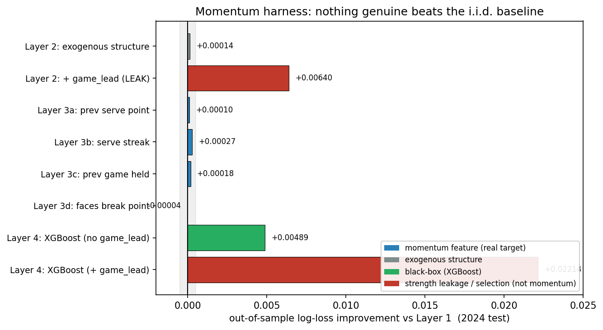
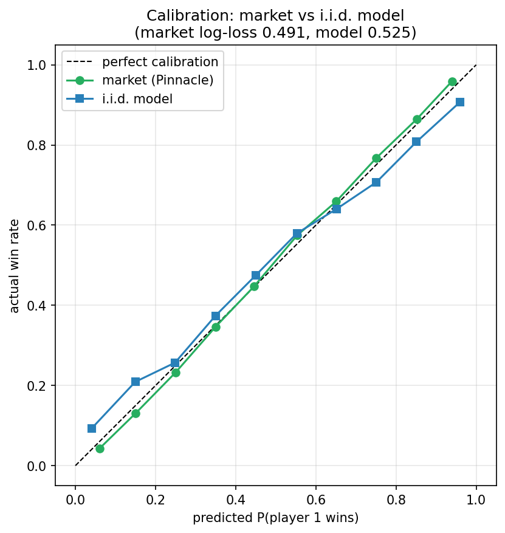
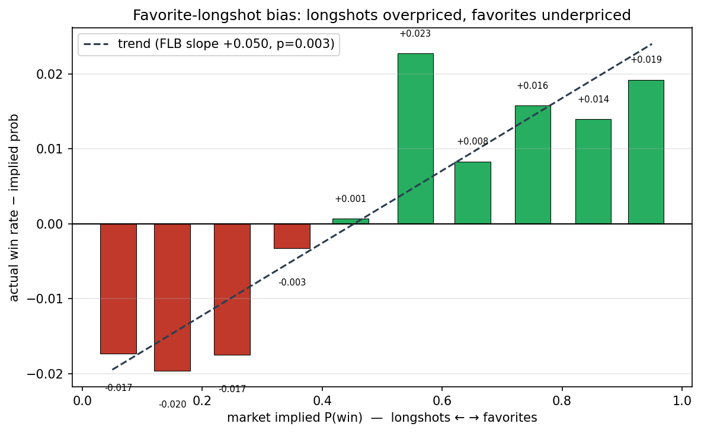
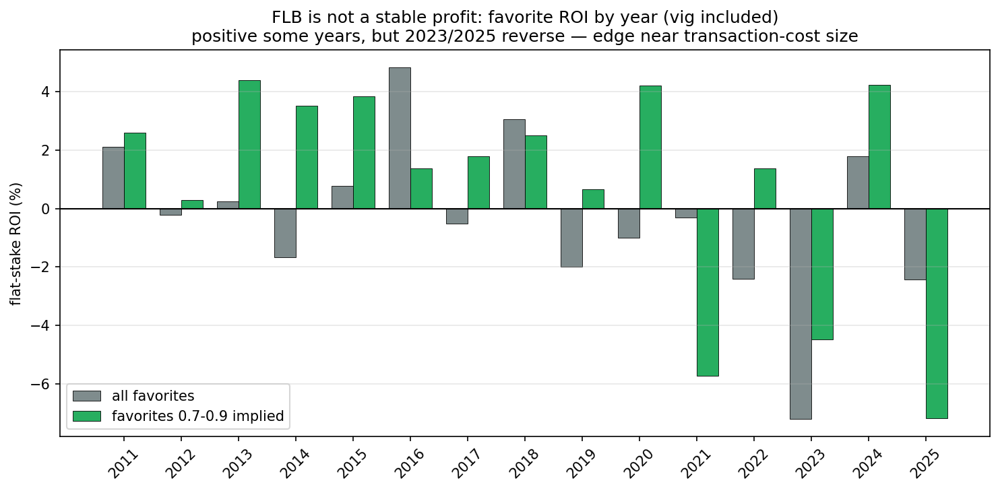
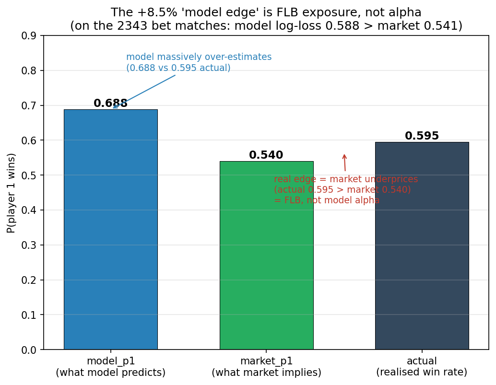

# Tennis: Momentum, Calibration & Market Efficiency

A from-scratch quantitative research project on ATP men's singles, built as a
portfolio piece. It runs as one connected investigation rather than three
separate models, organised around a single question:

> **Is "momentum" a property of the players, or of the people watching them?**

Three studies answer it in sequence:

1. **A calibrated forecasting model** — can a from-scratch skill model produce
   *trustworthy* match-win probabilities (not just pick winners)?
2. **A momentum falsification harness** — do players actually have momentum at
   the point level, or are serve outcomes ~i.i.d.?
3. **A betting-market mispricing study** — given that players are ~i.i.d., does
   the *market* misprice a hot hand that doesn't exist?

**The unifying finding:** momentum is an *observer* phenomenon, not a player
one. Players are ~i.i.d.; the market does not overreact to streaks and is hard
to beat; the only structural bias (favorite-longshot) is thin, unstable, and
priced near transaction-cost size — what an efficient, sharp market looks like.

The emphasis throughout is **calibration and intellectual honesty** — knowing
when *not* to trust a signal, and chasing down results that look too good until
they're either confirmed or explained away.

---

# Part 1 — A Calibrated Forecasting Model

A probabilistic forecasting model for ATP men's singles. The emphasis is
**calibration** — not just predicting the winner, but producing match-win
probabilities that are *trustworthy* and could be used to price a market. The
headline deliverable is a calibration study, not a betting record: a market
maker cares whether a stated 70% really happens 70% of the time.

## Approach

The model has two layers.

**1. Skill layer — a dynamic Bayesian serve/return filter.**
Each player holds a Gaussian belief over two latent skills: serve and return.
Every match contributes a binomial observation (serve points won / played), which
updates both the server's serve skill and the returner's return skill via an
approximate Kalman update (linearising the binomial-logit likelihood). Skills
drift over time as a random walk, so the model tracks form, ageing, and layoffs.

A per-player **grass offset** sits on top of overall skill, with a zero-mean prior
that shrinks toward overall skill when grass data is thin — the central modelling
idea, since grass is only ~10% of tour matches.

**2. Distribution layer — a hierarchical Markov match engine.**
Per-point serve probabilities feed an analytic game → set → match model
(Klaassen–Magnus), giving the full match-win probability and the distribution of
outcomes, not just a point estimate.

**Calibration.** Raw probabilities turn out to be over-confident (the Markov
structure amplifies small per-point edges). Temperature scaling, fit on a holdout
year, restores calibration.

## Results (strictly out-of-sample, no look-ahead)

The filter is only ever trained on matches *preceding* the evaluation period.

| Test year | accuracy | log-loss (raw) | log-loss (calibrated) | temperature |
|-----------|----------|----------------|-----------------------|-------------|
| 2024      | 0.63     | 0.71           | 0.67                  | 1.35        |
| 2025      | 0.62     | 0.71           | 0.67                  | 1.30        |

~62–63% accuracy is in line with the academic literature for pre-match ATP models.

**Calibration.** The raw model is over-confident; temperature scaling restores it:


**Hyperparameter tuning** (walk-forward, out-of-sample log-loss):


See [`notebooks/03_calibration_study.ipynb`](notebooks/03_calibration_study.ipynb)
for the full study.

## Key findings

1. **The serve/return filter recovers true skill.** On synthetic data with known
   skills it recovers serve and return ratings at correlation > 0.95.

2. **Raw probabilities are over-confident; calibration fixes it.** The reliability
   curve initially bows away from the diagonal (a predicted 0.9 wins ~0.78 of the
   time). Temperature scaling pulls it back without changing accuracy.

3. **More data beats post-hoc patching.** Using the full training history dropped
   the needed temperature from ~3.5 to ~1.3 — the raw probabilities became nearly
   well-calibrated on their own, showing the over-confidence was largely an
   estimation-noise problem, not a structural one.

4. **Surface-specific effects cannot be reliably estimated from sparse grass data.**
   A τ² grid search shows that *stronger* shrinkage of the grass offset always
   helps; the model is best off leaning almost entirely on overall skill. This is
   a deliberate, data-driven choice — and exactly the kind of "when not to trust a
   signal" judgment the shrinkage prior is designed to make.

## Model vs market

The real test for a pricing model is the market. On 1915 matched 2025 matches
(paired by player and year-month to disambiguate repeat meetings), the model is
compared against Pinnacle closing odds (de-vigged):

| | log-loss | Brier | accuracy |
|---|---|---|---|
| model     | 0.656 | 0.230 | 0.622 |
| Pinnacle  | 0.605 | 0.210 | 0.669 |

The model does **not** beat the market — as expected; a top sharp book is very
hard to beat. But an independent from-scratch model lands within ~0.05 log-loss
of Pinnacle, correlating at 0.73 — it captures most of the market's signal while
retaining independent information. Honestly quantifying the gap to a sharp
benchmark matters more than claiming to beat it.(This is a quick 2025 all-tour check; Part 3 runs the full 2011–2025 Grand Slam analysis with walk-forward beliefs and a favorite-longshot-bias study.)

See [`notebooks/model_vs_market.py`](notebooks/model_vs_market.py).

---

# Part 2 — A Momentum Falsification Harness

Does relaxing the i.i.d.-on-serve assumption help predict the *next* serve
point? Part 1 assumed points are i.i.d. within a match (Klaassen–Magnus). Part 2
stress-tests that assumption with a layered falsification harness: each layer
must beat the one below it **out-of-sample, after calibration**, or the added
structure is rejected.

The dataset is **648,149 men's-singles points** (Wimbledon + US Open,
2011–2024, from Sackmann's point-by-point feed), with a walk-forward skill
belief attached to every point. Train 2011–2023, test 2024.

## The ladder

| layer | what it adds | OOS Δ log-loss vs Layer 1 |
|---|---|---|
| **1. i.i.d. baseline** | constant skill-based `p_serve` | — (log-loss 0.6444, ECE 0.002) |
| **2. structure** | score state (games, set) | +0.0001 (real but negligible) |
| **3. momentum** | prev point / streak / prev game / break point | ≤ +0.0003 each |
| **4. black box** | XGBoost on all features | gain decomposes into leakage/selection |



## Key findings

1. **Every momentum effect is real but tiny.** Winning the last point, being on
   a streak, or having just held serve lifts the next-point win probability
   slightly; facing a break point lowers it. All directionally consistent with
   Klaassen–Magnus — but after controlling for skill, the best out-of-sample
   improvement is +0.0003 log-loss. Negligible.

2. **The raw signals are mostly strength confound.** A 4pp raw "previous game"
   gap collapses to nothing once `p_serve` is in; the streak / game features
   visibly pull the skill coefficient down (the same leakage tell as a
   strength-proxy feature).

3. **The black box confirms the verdict rather than overturning it.** XGBoost's
   apparent +0.022 gain decomposes (via four diagnostics) entirely into
   strength leakage (`game_lead`, 78%) and situational *selection* (position
   features). **Pure time-momentum features contribute +0.0004 — nothing.** No
   model, linear or nonlinear, hand-built or learned, extracts usable momentum.

4. **A data-leak caught by suspicion.** The dataset's break-point columns are
   *post-point* state; using them leaks the outcome. A suspiciously large
   black-box gain led to the catch; the flag was rebuilt leak-free from
   pre-point within-game scoring. *A result that good demands suspicion, not
   celebration.*

5. **Predictive ≠ causal.** Replicating Gauriot & Page (2019), who find a +15%
   hot-hand effect on tight points (30–30/deuce) using Hawk-Eye quasi-random
   identification, the effect here *reverses* (coef −0.027) — because without
   their exogenous identification, conditioning on "reached deuce" introduces
   path dependence. Measuring *causal* momentum needs ball-tracking data the
   point-by-point feed lacks. The harness answers the *predictive* question, and
   the answer is: no usable momentum.

See [`notebooks/04_momentum_harness.ipynb`](notebooks/04_momentum_harness.ipynb).
Reproduces Klaassen–Magnus (2001) and stands with the null findings of
O'Donoghue–Brown (2009) and Moss–O'Donoghue (2017), while showing exactly how
naive raw-correlation momentum studies dissolve under skill control.

---

# Part 3 — Betting-Market Mispricing

If players don't actually have momentum (Part 2), does the **market** price one
anyway — overreacting to recent form the way Moskowitz (2021, *Asset Pricing and
Sports Betting*) finds bettors do in US team sports?

For every Grand Slam men's singles match 2011–2025 (**7,351 matches**), compare:
- **market** — de-vigged Pinnacle closing odds (sharp book, 99.7% coverage)
- **model** — the Part 1 i.i.d. skill model, a clean *no-momentum* fair value

## Is the model a fair baseline?



Both are well-calibrated; the market is sharper (log-loss 0.491 vs 0.525). The
model loses on accuracy — expected, since the market absorbs information the
model lacks — but not by much, so it qualifies as an honest no-momentum
benchmark. (Consistent with the literature: even a 2025 graph-neural-network
model trails the market, Brier 0.215 vs 0.196.)

## Key findings

1. **No momentum overreaction — the opposite.** Regressing `(market − model)` on
   recent win rate gives a coefficient of **−0.16** (t = −17.8): the market is
   *more* conservative on hot players than the i.i.d. model. And the market's
   deviations from the model strongly predict outcomes (`p1_won ~ model + diff`,
   diff coef +4.1, z = 19) — the market carries *real* information, not noise.

2. **The model has independent incremental info.** `p1_won ~ market + model`
   gives the model a significant coefficient (+1.37, z = 7.5) on top of the
   market — a clean skill basis not subsumed by the price.

3. **A real favorite-longshot bias (cross-section).** Longshots are overpriced,
   favorites underpriced; the slope of (actual − implied) on implied is **+0.050
   (p = 0.003)**, consistent with the ATP literature.

   

4. **…but not a stable, tradeable profit.** Betting favorites at actual Pinnacle
   odds (vig included), year by year, the edge flips sign — positive 2011–2020,
   reversing in 2023 and 2025 (matching the documented 2025 FLB reversal). On
   average it is near transaction-cost size.

   

5. **A tempting "+8.5% model edge" that isn't alpha.** Betting where the model
   disagrees with the market by >5% produced a seductive +8.5% ROI, rising with
   the threshold — a red flag in a sharp market. Diagnosis (placebo tests, leak
   checks, subset calibration) showed the model is *less* accurate on these
   matches (log-loss 0.588 vs 0.541) and over-estimates p1 massively (0.688 vs
   0.595 actual). The return is FLB exposure through a biased model, not
   independent alpha — and, like the FLB, unstable across years.

   

**Verdict.** The Grand Slam men's market is highly efficient. A simple i.i.d.
model can't beat it and has no tradeable alpha; the one structural bias (FLB) is
thin, unstable, and compressed to transaction-cost size. In a sharp market,
simple statistical and momentum edges are already priced in.

See [`notebooks/05_mispricing.ipynb`](notebooks/05_mispricing.ipynb).

---

## Intellectual lineage

The framing here traces back to a prior equity-factor project: a "team coin" stock-momentum factor, inspired by Moskowitz (2021), that treats an individual stock's win/loss streaks like a sports team's and asks whether the market over-reacts to them. This project turns the same question on the literal sports market, and inverts it: rather than assuming streaks matter and pricing them, it first asks whether streaks matter *at all* (Part 2: they don't, for the players), then whether the market prices a streak effect that isn't there (Part 3: it doesn't over-react).

The methodological template is identical across both domains — strip out the strength/size confound, test strictly out-of-sample, hunt for leakage, and distinguish a real signal from a behavioural bias. The recurring lesson is the one a market maker cares about most: knowing when a tempting signal is actually a confound.

## Project structure

**Core library** (`src/tennis_forecast/`)
- `data.py` — load match data, serve/return observations, odds
- `filter.py` — Bayesian serve/return Kalman filter (skill layer)
- `markov.py` — game/set/match win-probability engine
- `pipeline.py` — skills → per-point serve probability
- `pricing.py` — de-vig, log-loss, Brier, reliability, temperature scaling
- `simulate.py` — Monte-Carlo match & tournament simulation
- `names.py`, `pbp.py` — point-by-point name resolution & per-point dataset
- `odds_names.py`, `mispricing.py`, `mispricing_test.py` — odds resolution &
  market study

**Notebooks**
- `03_calibration_study.ipynb` — Part 1 calibration figures
- `04_momentum_harness.ipynb` — Part 2 momentum falsification
- `05_mispricing.ipynb` — Part 3 market efficiency
- `harness_common.py`, `layer*.py`, `diag_*.py` — harness layers & diagnostics
- `flb_backtest.py`, `flb_by_year.py`, `model_edge_backtest_clean.py` — market
  backtests
- `tune_*.py`, `evaluate_*.py`, `explore_filter.py` — Part 1 studies

## Methodology notes

- **Inference:** approximate Kalman filter (linearised binomial-logit
  likelihood), in the spirit of Szczecinski–Tihon (2023).
- **Match model:** Klaassen–Magnus point-based Markov chain (points assumed
  i.i.d. within a match — a simplification *validated* by Part 2).
- **Hyperparameters:** drift γ = 0.10, grass-shrinkage τ² = 0.005, both chosen by
  walk-forward cross-validation on out-of-sample log-loss.
- **No look-ahead:** beliefs trained only on matches preceding each evaluation
  period; temperature fit on a holdout year.

## Honest caveats

- Surface is coarse (grass / non-grass only, so clay and hard are conflated).
- De-vigged probabilities aren't true probabilities under FLB
  (cf. ScienceDirect 2024 on normalized-probability regressions).
- Only closing odds are available, so Moskowitz's open→close price-drift test
  can't be run; the market study is the normalized-probability variant.
- Thin/stale skill beliefs are not yet filtered out (a possible robustness add).
- Raw conditional subset means are slightly biased low in finite samples
  (Miller–Sanjurjo); this does not change the negligible OOS conclusions.

## Reproducing

```bash
python -m venv .venv && source .venv/bin/activate
pip install -r requirements.txt
```

Data is not committed. Download:
- ATP match data: [Jeff Sackmann's tennis_atp](https://github.com/JeffSackmann/tennis_atp) → `data/raw/`
- Point-by-point: [Sackmann's tennis_slam_pointbypoint](https://github.com/JeffSackmann/tennis_slam_pointbypoint) → `data/raw/pbp/`
- Closing odds: [tennis-data.co.uk](http://www.tennis-data.co.uk/alldata.php) → `data/raw/odds/`

```bash
python tests/test_filter.py                  # validate the filter
python notebooks/evaluate_predictions.py     # Part 1 OOS evaluation
python notebooks/eval_layer1.py              # Part 2 harness layers
python -m tennis_forecast.mispricing         # Part 3 match table
```

## Data sources

- Match results & serve statistics: Jeff Sackmann `tennis_atp` (CC BY-NC-SA)
- Point-by-point: Jeff Sackmann `tennis_slam_pointbypoint`
- Closing betting odds: tennis-data.co.uk

## License

Code under MIT (see `LICENSE`). Data is subject to its providers' licenses and is
not redistributed here.